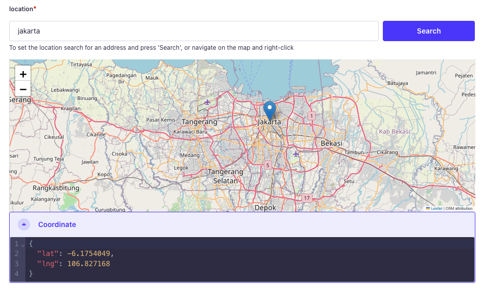
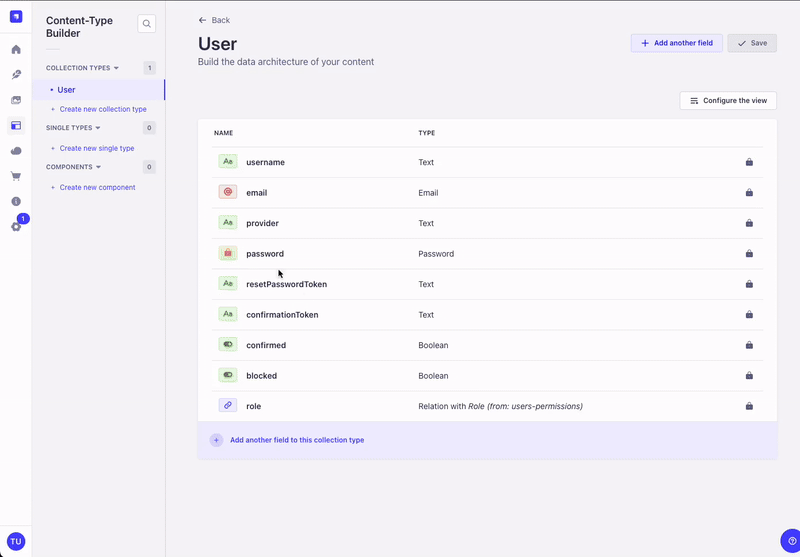

# Strapi Location Picker

Easily add location selection to your Strapi project!

<div align="center">


</div>

The **Strapi Location Picker** plugin lets you integrate a smooth and intuitive location picker into your Strapi admin panel. Perfect for projects that require geolocation data, such as stores, events, user profiles, or delivery services.

## ✨ Features

- 🗺 **Interactive Map Picker** – Select locations with a simple click.
- 🔍 **Searchable Maps** – Quickly find locations by searching addresses or place names.
- ✅ **Seamless Strapi Integration** – Works natively with your content types.
- 🚀 **Easy Installation** – Get started in minutes!

## Preview






## ❗ Requirements

- Strapi v5

## 🚀 Installation

```sh
# npm
npm install strapi-location-picker

# yarn
yarn add strapi-location-picker

# pnpm
pnpm install strapi-location-picker
```

## 🛠️ Configuration

After installation, enable the plugin and customize the `strapi::security` middleware inside `./config/middlewares.js`

Instead of:

```js
export default [
  // ...
  'strapi::security',
  // ...
];
```

Write:

`middlewares.js`

```js
export default [
  // ...
 {
    name: 'strapi::security',
    config: {
      contentSecurityPolicy: {
        useDefaults: true,
        directives: {
          "connect-src": ["'self'", "https:"],
          "script-src": [
            "'self'",
            "unsafe-inline",
            "https://*.basemaps.cartocdn.com",
          ],
          "media-src": [
            "'self'",
            "blob:",
            "data:",
            "https://*.basemaps.cartocdn.com",
            "https://tile.openstreetmap.org",
            "https://*.tile.openstreetmap.org",
          ],
          "img-src": [
            "'self'",
            "blob:",
            "data:",
            "https://*.basemaps.cartocdn.com",
            "market-assets.strapi.io",
            "https://*.tile.openstreetmap.org",
            "https://unpkg.com/leaflet@1.9.4/dist/images/",
          ],
        },
      },
    },
  },  
  // ...
];
```

## 📌 Why Use Strapi Location Picker?

This plugin simplifies location management in your Strapi project, making it easier to store and manage geographic data without any hassle.


## ⚙️ Advanced Usage

#### Set as a Required Field

To make the location field mandatory in your content type, update your model schema in

`./src/api/[your-model]/content-types/[your-model]/schema.json`

Make sure the `required` value is true:

```js
{
  "attributes": {
    "[your_location_field]": {
      "type": "json",
      "required": true
    }
  }
}
```


## 🙌 Credits

This plugin is built upon existing work and contributions from the open-source community. Special thanks to previous developers and contributors whose work helped shape this plugin.

- https://github.com/red-made/strapi-geodata